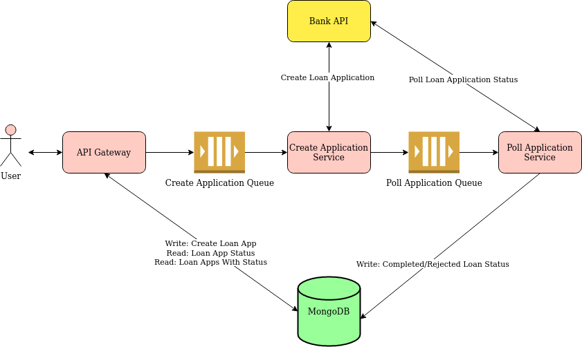

# Context
This project demonstrates the use of a typical microservice architecture, designed to provide
improved reliability, scalability and agility to users of a banking API.

I wrote this project in 2022 over the course of 4 days as part of a take home job interview.

It was my first time working with Go and my first time working with microservices as previously all
of my experience was with a monolithic Java application.

Originally, the "bank-api" service was a docker image supplied by the company I interviewed with. 
I have taken steps to replace this with a custom implementation of the same API with the same behaviour.

The "bank-api" service can be called to create new loan applications which sit a "pending" state between
5 and 20 seconds before moving to either "completed" or "rejected".

The rest of the services contained in this project, which I was responsible for designing, enable users to 
create new loan applications, and query the status of these loan applications, without directly going to the
"bank-api"

To learn more, jump to the [Design](#Design) section of this doc.


# Getting Started
## Prerequisites
The following software is required to run this project
- docker
- docker compose

For installation instructions, please see: https://docs.docker.com/compose/install/

Note also that:
- The docker daemon must be running
- Port 8081 must be available on your system

## Running
The easiest way to run this project is via docker compose.

Once installed, use the following command in the root directory of the project:
```
docker compose up
```

This starts all of the required services for this assignment. It may take a few seconds to startup.

Once running, you can access the API specification here:
- http://localhost:8081/swagger/index.html

When you are finished using the API, press Ctrl + C to shutdown the containers.
Finally, to remove the containers and clean up any volumes used by the containers, you can use the following command:

```
docker compose down -v
```

# Design


## Overview
Three primary components have been created for this project:
1. The API gateway
2. The Create Application service
3. The Poll Application service

In addition, the following components exist:
- RabbitMQ is used as a message broker to exchange messages between the microservices
- MongoDB is used as a persistent datastore


## Discussion
The separation of functionality into three primary components is an effort to provide improved reliability, scalability and agility.

## API Gateway
### Responsibilities
The API Gateway is responsible for:
- Accepting requests to create new loan applications
- Storing new loan requests in the persistent datastore
- Publishing to a message queue. Messages on this queue are consumed by the Create Application Service
- Accepting requests for the status of an application. Responses to these requests provide a view of an application via the persistent datastore, not the bank API directly
- Accepting requests for all of the applications matching a given status. Responses to these requests provide a view of an application via the persistent datastore, not the bank API directly

Separation of the API gateway component from the Create Application service provides the following benefits:
- Separation of concerns
- Improved client response times
- Decoupling from the bank API. If the bank API is down, clients still receive information about their loan application. 
 
## Create Application Service
### Responsibilities
The Create Application service is responsible for:
- Consuming messages from a RabbitMQ queue
- Given a message, it will create a loan application with the bank API
- Publishing to a message queue. Messages on this queue are consumed by the Poll Application Service

Separation of the Create Application service provides the following benefits:
- Separation of concerns
- Improved scalability, as multiple Create Application services can consume off the queue to meet demand.

## Poll Application Service
### Responsibilites
The Poll Application service is responsible for:
- Consuming messages from a RabbitMQ queue.
- Given a message, it will poll the status of an application with the bank's 'jobs' endpoint
- Once an application has reached the complete/rejected status, it will update the status of the application in the persistent datastore

Separation of the Poll Application service provides the following benefits:
- Separation of concerns
- Improved scalability, as multiple Poll Application services can consume off the queue to meet demand
- Improved reliability. If the bank's 'jobs' endpoint is experiencing issues, the Create Application service may still submit loan applications.

Note that the Poll Application service does not 'busy wait' for pending applications. Instead, it re-queues these applications.
This is an effort to prevent slowly processing loans from holding up the service while other loans on the queue may have already finished processing by the bank.

## Persistent Datastore
MongoDB has been chosen for the persistent datastore.

### Data Model
```
Loan Application Document
{
  _id: <ObjectID>, (Unique & Indexed)
  status : "Example status", (Indexed)
  firstname : "Example First Name",
  lastname : "Example Last Name"
}
```

# Project Layout
The three primary components can be found as follows:
- API Gateway: ./api-gateway
- Create Application service: ./create-application-service
- Poll Application service: ./poll-application-service

Additionally, shared behaviour can be found in
- ./service-shared 

# Testing
Unit testing is provided within each of the directories mentioned in [Project Layout](#project-layout)

Additonally, a few integration tests are provided. For more information on these integration tests, please see:
- integration-testing/newman/README.md


## Future Enhancements
There are several enhancements which could be made to this project in future.
To mention a few:
- Encrypting data at rest and in transport
- TTL indexes on db entries for loan applications. This would allow the DB to delete expired loans, currently loan applications live forever in the DB
- Automatic reconnects to both RabbitMQ and MongoDB for each of the services
- A dead letter queue for each of the message queues
- Enhanced integration testing. This might involve reliability tests which simulate environments where the bank API goes down, or the DB goes down etc
- The integration of metrics for each service
